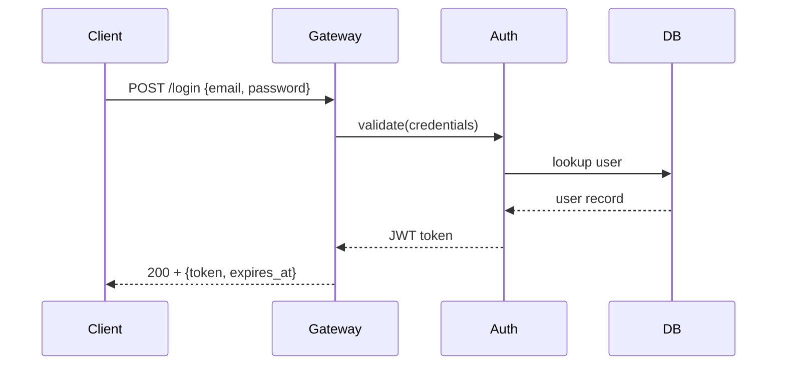

# Documentation Writing Standards

General writing standards for all documentation produced under this system. For structure and format specifics, see `spec-format.md`, `ontology.md`, and `folder-structure.md`.

---

## Language

- Use precise, stable terminology. Define shared terms once in `docs/reference/glossary.md`.
- Avoid hedging: "usually", "kind of", "probably", "roughly" — unless uncertainty is the point.
- If something is undecided, label it explicitly: "**[UNDECIDED]** The retry strategy has not been finalized."
- Prefer active voice: "The system returns a token" not "A token is returned by the system."
- Use present tense: "validates" not "will validate."
- **Protocol language:** When describing API contracts, use exact field names, types, and values. Not "a token is sent" but "the response body includes `access_token: string` with `expires_in: 3600` (seconds)."

---

## Code Examples

- Must be copy-pasteable when presented as runnable examples.
- Include language tags on all fenced code blocks.
- Use placeholders for variable values and mark them clearly.

Good:
````markdown
```typescript
const client = new AuthClient({ baseUrl: "<your_base_url>" });
await client.login({ email: "<user_email>", password: "<user_password>" });
// Replace placeholders before running.
```
````

Bad:
````markdown
```typescript
const client = new AuthClient({ baseUrl: url });
await client.login(credentials);
```
````

---

## Diagrams

- Prefer text-first, versionable diagrams: Mermaid, PlantUML, ASCII art.
- Use diagrams when structure or flow is easier to see than explain.
- Every diagram needs a caption or preceding sentence explaining what it shows.
- **Protocol diagrams** are mandatory for any spec involving communication. Show message formats, sequence, and state transitions.

ASCII example:
```
Client → Gateway → Auth Service → DB
                ↘ Cache
```

Protocol diagram example:
```
Client                    Gateway                    Auth Service
  | POST /login              |                            |
  |------------------------->|                            |
  |                          | POST /validate             |
  |                          |--------------------------->|
  |                          |                            |
  |                          |<---------------------------|
  |                          | 200 + {token, user_id}     |
  |                          |                            |
  |<-------------------------| 200 + {token, expires_at}  |
  |                          |                            |
```

Mermaid example:
````markdown

````

---

## Internal Behavior Documentation

Every spec and architecture document must explain what the system does *internally* — not just what the user sees. Internal behavior includes:

- **State machines** — states, events, transitions, side effects
- **Processing pipelines** — stages, inputs, outputs, decision rules
- **Decision logic** — the rules the system uses to make choices internally
- **Message flows** — how components communicate at the protocol level
- **Error propagation** — how errors flow through the system internally

**Good:** "The system validates the request against the schema, then checks the rate limiter. If the rate limit is exceeded, the system rejects the request immediately without reaching the business logic."
**Bad:** "The user sees an error message."

**Good:** "The system enters a retry loop with exponential backoff, capped at 5 attempts."
**Bad:** "The API returns a 500 error."

## Links and Boundaries

- Cross-link related sections: "See [Error Handling](error-handling.md) for failure modes."
- Link to ADRs for important design decisions.
- For external systems, document the contract and expectations — not their internals.
- If another repo has canonical docs, link to that repo instead of rewriting locally.
- Use relative paths for all internal links.

---

## Deprecation

- Never silently delete documented behavior.
- Mark deprecated behavior clearly: state replacement, timeline, and reason.

```markdown
> **Deprecated since vX.Y.** Use [new-thing] instead. Planned removal: vX.Z.
> Reason: [why it was deprecated].
```

- Add `status: deprecated` to the document's frontmatter.
- On the replacement doc, add `links: supersedes: [old-doc.md]`.

---

## Intentionally Undocumented

When a detail is deliberately left unstable or internal:

```markdown
> Intentionally undocumented — internal detail, subject to change without notice.
```

---

## Tables

- Every table has a header row.
- Align pipes for readability when practical.
- Include units in column headers when applicable: "Timeout (ms)", "Size (bytes)".

Example:
```markdown
| Field | Type | Required | Notes |
|-------|------|----------|-------|
| email | string | yes | Must be valid email format |
| timeout_ms | number | no | Default: 5000 |
```

---

## Recommended Reading Order

When onboarding or orienting to the documentation:

1. `docs/INDEX.md` — master map
2. `docs/overview/product.md` — what this is and why
3. `docs/reference/glossary.md` — shared vocabulary
4. `docs/spec/INDEX.md` → relevant spec files — behavioral contracts
5. `docs/architecture/INDEX.md` → relevant arch files — implementation shape
6. `docs/architecture/decisions/` — decision history
7. Code — only when docs are silent, stale, or ambiguous

---

## When Reporting

Always structure answers as:

- **What overview says** — product identity and scope, user experience principles
- **What spec says** — exact behavioral requirements, protocol contracts, internal behavior
- **What architecture says** — implementation structure, internal processing, component communication
- **What code does** (if inspected) — actual behavior
- **Whether they agree** — flag discrepancies between any layer

When reporting on a spec, always include:
- **User experience** — what the user experiences and perceives
- **Protocol** — API contracts, message formats, wire protocols
- **Internal behavior** — state machines, processing pipelines, decision logic

---

## Quick Reference — Doc Types

| Doc Type | Audience | Primary Question | Contains | Does NOT contain |
|----------|----------|-----------------|----------|-----------------|
| Overview | Humans, stakeholders | Why does this exist? | Identity, purpose, user experience principles, non-goals | Behavior details, tech choices |
| Spec | Implementers, testers, agents | What must it do? | Requirements, scenarios, protocol contracts, internal behavior, state machines | UI details, implementation structure, framework choices |
| Architecture | Maintainers, agents | How is it built? | Components, dependencies, internal processing, communication protocols | Behavioral requirements, user-facing contracts |
| Guide | Users, contributors | How do I do X? | Step-by-step procedures | Specs, architecture decisions |
| ADR | Maintainers | Why was this decided? | Decision context, rationale, consequences | Implementation details |
| Runbook | Operators | How do I operate X? | Operational procedures, incident response | Business logic, specs |
| INDEX.md | Everyone | Where is everything? | Maps, links, summaries | Content |
